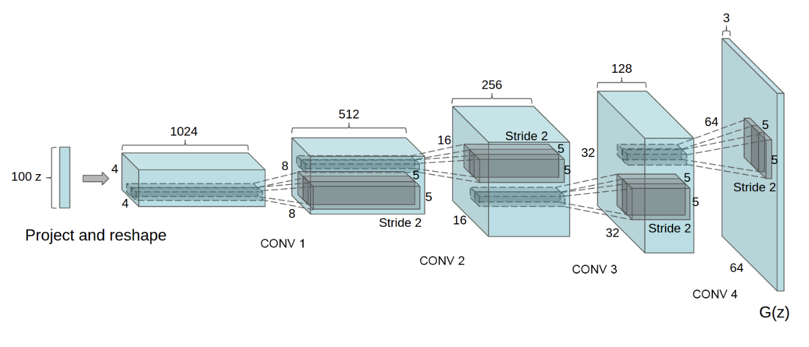
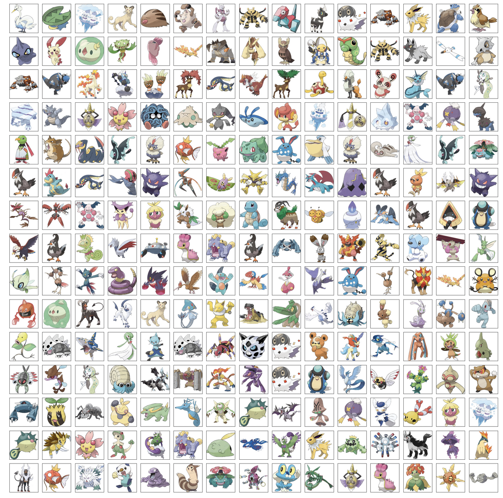
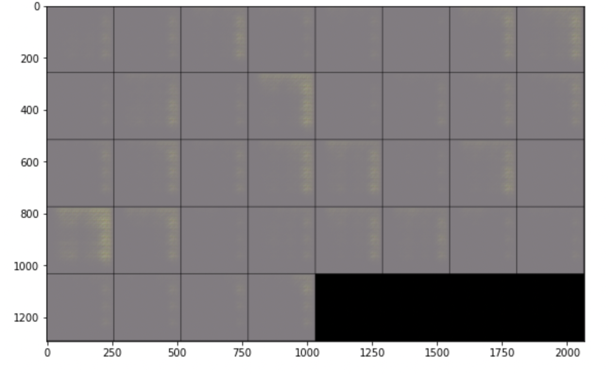
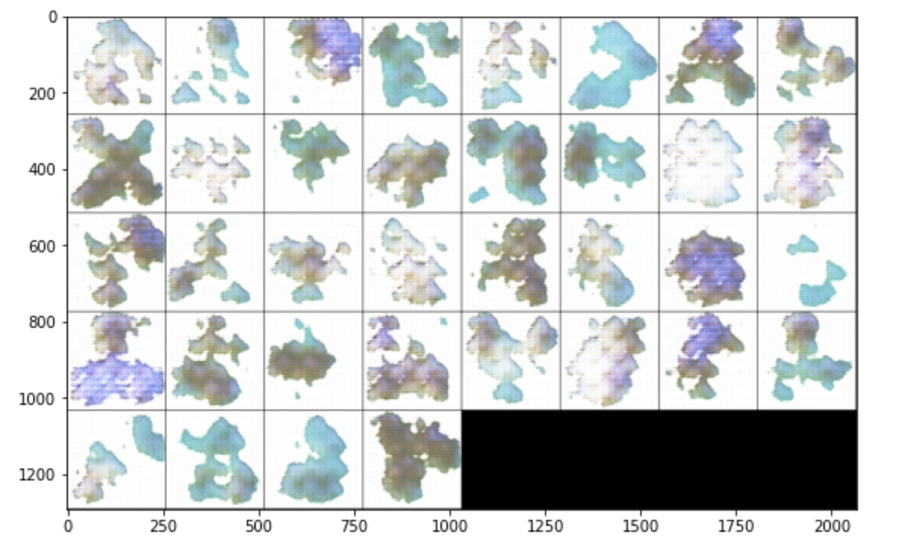
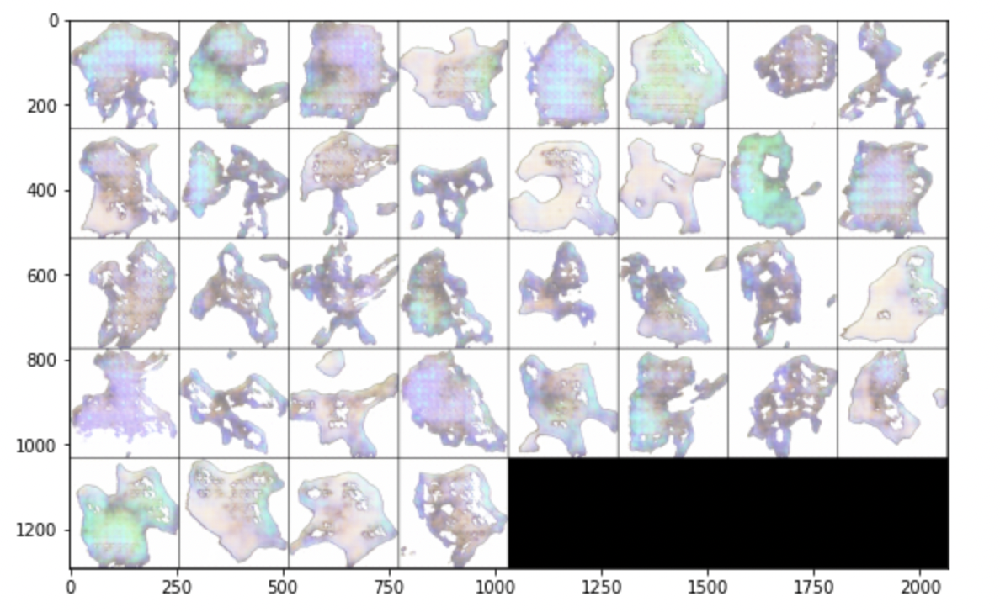
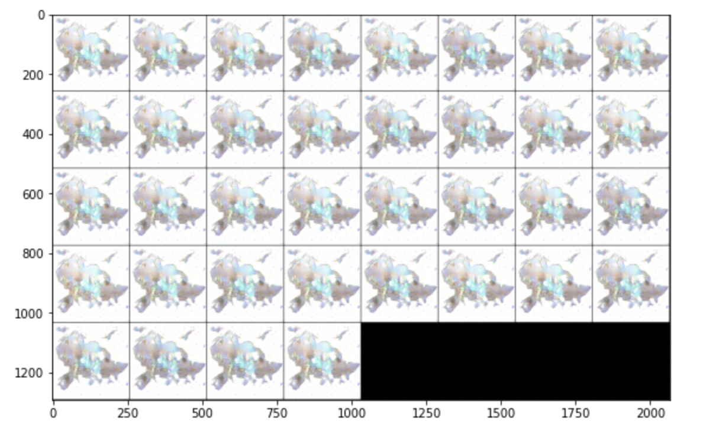

# DCGAN on Pokémons

If it takes too long to render in GitHub itself, take a look at it @ Kaggle.

- Notebook Link: https://www.kaggle.com/code/aneesh10/dcgan-on-pok-mon-images

- Dataset Link: https://www.kaggle.com/datasets/kvpratama/pokemon-images-dataset

Also consider upvoting!

## Architecture Details

## Inputs

## Outputs

### Epoch 0

### Epoch 20

### Epoch 50

### Epoch 100

## Obersvations

The learning is quite unstable, if we look at the intermediate output on the fixed noise. Also, the model is kind off overfitting with some attributes of a few pokémons. This might be corrected, with some additional regularization. 